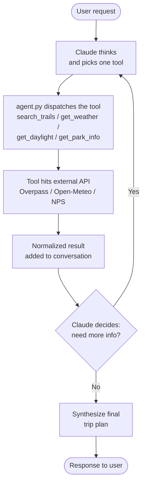

# Trail Adventure Planner

An agent that plans outdoor trips by pulling live data from hiking, weather, and park APIs and turning it into a usable itinerary.

## Motivation

I plan a lot of trips and run the same research workflow every time: check OpenStreetMap for trails, look up the forecast, check sunrise and sunset, and skim NPS alerts if it's a national park. I wanted that workflow as an agent — using sources I trust, not whatever a general-purpose chatbot was trained on.

## Quick start

### Prerequisites
- Python 3.11+
- Node.js 20+
- An Anthropic API key

### 1. Clone and configure

```bash
git clone <repo-url> agentic_outdoors
cd agentic_outdoors
cp .env.example .env
```

Edit `.env`:

```
ANTHROPIC_API_KEY=sk-ant-...
NPS_API_KEY=
```

| Key | Required | Where to get it |
|---|---|---|
| `ANTHROPIC_API_KEY` | Yes | [console.anthropic.com](https://console.anthropic.com) |
| `NPS_API_KEY` | No (only for `get_park_info`) | [nps.gov/subjects/developer/get-started.htm](https://www.nps.gov/subjects/developer/get-started.htm) |

Trails, weather, and daylight use free APIs that don't need keys.

### 2. Backend

```bash
python3 -m venv .venv
source .venv/bin/activate
pip install -r requirements.txt
uvicorn server:app --reload --port 8001
```

### 3. Frontend

```bash
cd ui
npm install
npm run dev
```

Open `http://localhost:5173`.

### 4. Run the eval

```bash
source .venv/bin/activate
python eval.py
```

## Project structure

```
agentic_outdoors/
├── agent.py          # Agent loop
├── tools.py          # The four tools + geocoder
├── prompts.py        # System prompt and tool schemas
├── server.py         # FastAPI app with streaming chat endpoint
├── config.py         # Loads .env
├── eval.py           # Eval suite (18 queries, 4 metrics)
├── requirements.txt
├── .env.example
└── ui/               # React frontend (Vite)
```

| File | What it does |
|---|---|
| `config.py` | Reads API keys and the model name from `.env`. |
| `tools.py` | The four tool functions and a shared `geocode()` helper. Each tool hits one external API and returns a normalized dict. |
| `prompts.py` | The system prompt that defines the agent's workflow, plus the JSON tool schemas Claude sees. |
| `agent.py` | The agent loop. Sends messages to Claude, dispatches tool calls, feeds results back, and keeps going until Claude says it's done. |
| `server.py` | FastAPI app with one `POST /chat` endpoint that streams the agent's events to the frontend. |
| `eval.py` | Runs the test queries and prints scores. |
| `ui/src/App.jsx` | The chat UI: input box, live reasoning trace, result cards, final response. |

## How the agent works

The agent runs a **think → act → observe → decide** loop. Claude is the one running the loop, not the Python code.



Each turn, `agent.py` sends the full conversation (including all previous tool results) to Claude. Claude either calls one more tool or returns text and stops. `tool_choice` is set with `disable_parallel_tool_use=true`, so Claude has to call tools one at a time and see each result before deciding the next step.

The loop is implemented as a Python generator. Each step yields an event (`text`, `tool_call`, `tool_result`, or `done`), which `server.py` forwards to the frontend over Server-Sent Events. That's how the UI shows the agent's reasoning live as it's happening.

### Tools

| Tool | What it returns | API |
|---|---|---|
| `search_trails(location, radius_km)` | Named hiking trails near a place | Overpass API (OpenStreetMap) |
| `get_weather(location, days)` | Daily high/low, conditions, rain chance, wind in local time | Open-Meteo |
| `get_daylight(location, date)` | Sunrise, sunset, day length in local time with timezone abbreviation | Open-Meteo |
| `get_park_info(park_query)` | Park description, current alerts, campgrounds | NPS Developer API |

All four tools call a shared `geocode()` helper (Nominatim) to convert place names to lat/lon before hitting the downstream API. Each tool returns a plain dict; on failure the dict has an `error` key and the agent reads it and adapts.

## Why this is agentic

Calling one API from an LLM isn't an agent. A fixed pipeline isn't either. This system is an agent because Claude — not the code — makes every decision in the loop:

1. **Claude picks which tools to call.** "When's sunset in Moab?" triggers one tool. "Plan a weekend in Yosemite" triggers four. Same loop, different decisions.
2. **Claude calls tools one at a time and reacts to each result.** If a trail search fails, the next call can pivot instead of blindly continuing.
3. **Claude decides when to stop.** The loop runs until Claude returns text without a tool call. No fixed number of steps.
4. **Claude writes the final plan from what it found.** Not raw JSON — an actual itinerary with timing, gear, and safety tied to the specific data the tools returned.

## Evaluation

### What I'm testing

The eval needs to answer four separate questions, because each one is a different way the agent can fail:

1. Did the agent pick the right tools for the query?
2. Did the trail data actually come back?
3. Did the weather data come back valid?
4. Is the final response actually a useful trip plan?

A single score would hide the difference between "called the right tools but the plan was useless" and "called the wrong tools but happened to write a good answer." I wanted to see those independently.

### Test queries

`eval.py` has 18 queries written by hand to cover the kinds of things I'd actually ask:

- Broad trail queries (`Moderate hikes near Boulder, CO this weekend`)
- Filtered trail queries (`Easy trails under 5 miles near Asheville, NC`)
- National park trips (`Weekend camping trip in Yosemite`)
- Mixed park + trail (`Plan a day trip to Rocky Mountain National Park`)
- Single-tool queries (`When's sunset in Moab?`, `Current alerts for Glacier`)
- A spread of geography across the US

Some queries should trigger one tool, some four. The same agent loop should handle all of them.

### Metrics

| Metric | What it checks | How |
|---|---|---|
| **Tool F1** | Did the agent call the right tools? | Each query has an `expected_tools` set. Compute precision, recall, F1 against the actual calls. |
| **Trail relevance** | Did `search_trails` return real trails? | 1.0 for ≥3 named trails, 0.5 for 1–2, 0.0 for empty or error. |
| **Weather validity** | Did `get_weather` return well-formed data? | Each forecast day must have `high_f`, `low_f`, `conditions`. Score = fraction valid. |
| **Completeness** | Is the final response a useful plan? | A separate Claude call grades the response 0/0.5/1 on four criteria: specific trails, timing, gear, safety. |

I used Claude-as-judge for completeness because trip plans use different wording for the same content, and a keyword match would unfairly penalize valid responses. The judge gets explicit criteria in the prompt.

### Results

| Metric | Score |
|---|---|
| Tool precision | 0.78 |
| Tool recall | 1.00 |
| Tool F1 | 0.87 |
| Trail relevance | 0.38 |
| Weather validity | 1.00 |
| Completeness | 0.85 |

### Interpretation

The agent picks tools well. Recall is 1.00 across all 18 queries, meaning it never missed a tool that was needed. Precision sits at 0.78 because it sometimes adds an extra tool the user didn't strictly ask for — usually `get_daylight` on a trail query — which I'm fine with since extra context doesn't hurt the plan.

Final plans are consistently useful (0.85 completeness). The lower scores on this metric all come from narrow queries like "when's sunset in Moab?" where it would be weird to attach a gear list. Weather data came back clean every time (1.00).

The 0.38 on trail relevance is the only number I'm not happy with, and it isn't really an agent problem. The Overpass API gets rate-limited during a back-to-back eval run, so the second half of trail queries return errors. The same queries work fine when run one at a time. The agent recovers by pivoting to other tools, but the metric still counts the failed call as a miss. I'd need a paid Overpass instance or a different trail data source to fix it properly.

Overall: tool selection and synthesis work well, the agent loop behaves the way I want, and the weakest number is bottlenecked by an external free API rather than the agent itself.

## Notes on data sources

- **OpenStreetMap (Overpass).** Free but rate-limited. Trail coverage is great in well-mapped areas (Boulder, Yosemite, the Whites) and thinner in less-mapped places.
- **Open-Meteo.** Free, no key. Returns times in the location's local timezone via `timezone=auto`, which avoids a class of timezone bugs.
- **Nominatim.** OpenStreetMap geocoder. Used by every tool to convert place names to lat/lon.
- **NPS Developer API.** US national parks only. The only key required.
