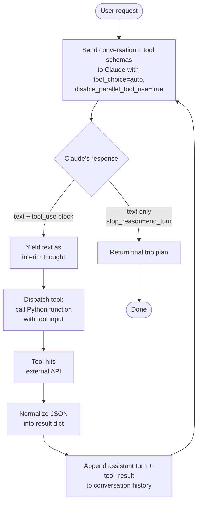
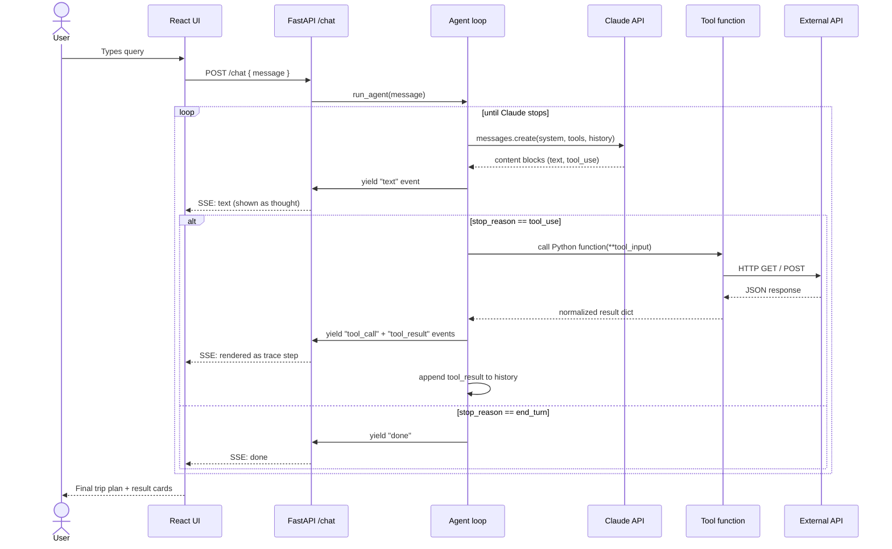
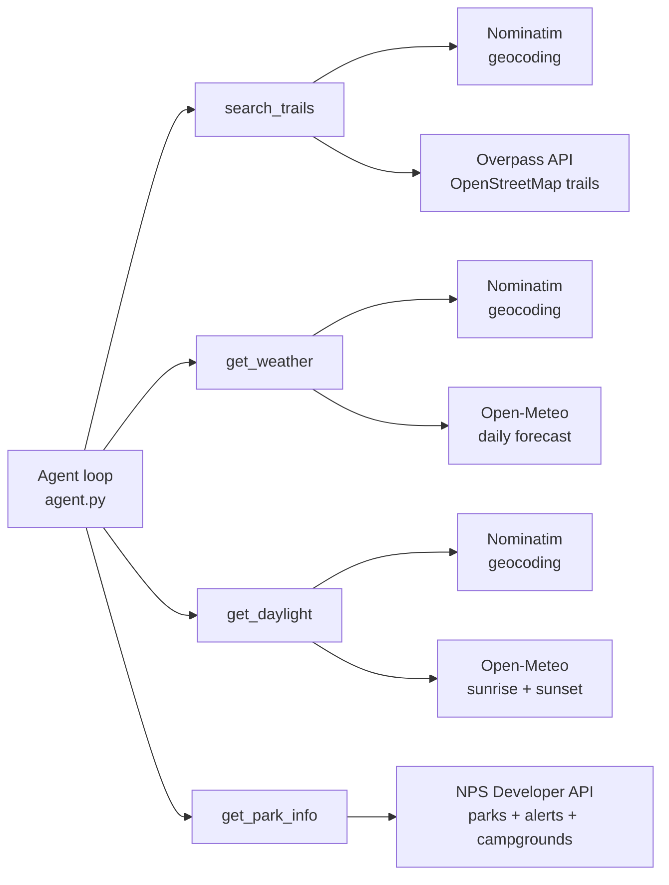

# Trail Adventure Planner

An agent that plans outdoor trips by pulling live data from trusted hiking, weather, and park sources, then synthesizing it into a practical itinerary.

## Motivation

I plan a lot of outdoor trips and it is one of my greatest joys. This project is the workflow I already do, built as an agent. It only queries sources I chose and trust: OpenStreetMap via Overpass for trails, Open-Meteo for weather and daylight, and the NPS Developer API for national parks. The agent decides which of those to call based on the request, sequences the calls, reacts to what it finds, and writes a plan that reads like the one I'd write for myself.

## Quick start

### Prerequisites
- Python 3.11+
- Node.js 20+
- An Anthropic API key

### 1. Clone and configure environment

```bash
git clone <repo-url> agentic_outdoors
cd agentic_outdoors
cp .env.example .env
```

Edit `.env`:

```
ANTHROPIC_API_KEY=sk-ant-...       # required
NPS_API_KEY=                       # optional, enables get_park_info
```

| Key | Required | Where to get it |
|---|---|---|
| `ANTHROPIC_API_KEY` | Yes | [console.anthropic.com](https://console.anthropic.com) |
| `NPS_API_KEY` | No | [nps.gov/subjects/developer/get-started.htm](https://www.nps.gov/subjects/developer/get-started.htm) — free, instant |

Weather, daylight, trails, and geocoding use free APIs that require no key.

### 2. Backend

```bash
python3 -m venv .venv
source .venv/bin/activate
pip install -r requirements.txt
uvicorn server:app --reload --port 8001
```

Backend runs on `http://localhost:8001`.

### 3. Frontend

In a separate terminal:

```bash
cd ui
npm install
npm run dev
```

Frontend runs on `http://localhost:5173`. Open it in a browser.

### 4. Run the evaluation

```bash
source .venv/bin/activate
python eval.py
```

Scores the agent across 18 test queries and writes results to `eval_results.json`.

## Project structure

```
agentic_outdoors/
├── agent.py          # Agent loop: calls Claude, dispatches tools, iterates
├── tools.py          # The four tool functions + geocoding helper
├── prompts.py        # System prompt and Anthropic tool schemas
├── server.py         # FastAPI app with SSE streaming chat endpoint
├── config.py         # Loads API keys and model name from .env
├── eval.py           # Quantitative eval: 18 queries, 4 metrics
├── requirements.txt  # Python dependencies
├── .env.example      # Template for environment variables
└── ui/               # React frontend (Vite)
    └── src/
        ├── App.jsx   # Chat UI, reasoning trace, result cards
        ├── App.css   # Cream-themed styling
        └── main.jsx
```

| File | Responsibility |
|---|---|
| `config.py` | Reads `ANTHROPIC_API_KEY` and `NPS_API_KEY` from `.env`. Defines the model identifier used throughout the project. |
| `tools.py` | Implements the four tool functions (`search_trails`, `get_weather`, `get_daylight`, `get_park_info`) and a shared `geocode` helper. Each tool calls one external API and returns a normalized dict. |
| `prompts.py` | Holds the system prompt that defines the agent's workflow and the JSON schemas that Claude receives for each tool. |
| `agent.py` | The control loop. Sends messages to Claude, detects `tool_use` blocks, dispatches them to the Python functions in `tools.py`, feeds results back as `tool_result` blocks, and continues until Claude stops calling tools. Implemented as a generator that yields events (`text`, `tool_call`, `tool_result`, `done`) so the server can stream them. |
| `server.py` | FastAPI app with one `POST /chat` endpoint. Runs `agent.run_agent()` and forwards each yielded event to the client as a Server-Sent Event. |
| `eval.py` | Runs 18 predefined queries through `run_agent_sync()`, scores each on four metrics, and prints a summary table. |
| `ui/src/App.jsx` | React app with a chat input, a live reasoning trace panel (shows each step as the agent thinks and acts), result cards for trails/weather/daylight/parks, and the final synthesized response. |

## How the agent works

The agent follows a classic **think → act → observe → decide** loop, with Claude driving every decision.

### Agent loop



At each iteration Claude sees the full conversation so far — including every previous tool result — and decides whether to call another tool or write the final answer. Because `disable_parallel_tool_use` is set, Claude must call one tool at a time, observe the result, and then decide what to do next. This is what makes the behavior visibly iterative rather than a single batched fan-out.

### Request lifecycle

End-to-end, from the user typing a message to the final plan rendering:



The important thing is that the agent loop is inside `run_agent()` in `agent.py`, not distributed across helpers or a framework. Each iteration is one Claude request, one tool call, one result added to history. The generator interface means the server can stream progress to the UI as it happens, so the user sees the agent's thinking in real time instead of a blank screen followed by a wall of text.

### Tools and the APIs they hit



| Tool | Purpose | External API | API key |
|---|---|---|---|
| `search_trails(location, radius_km)` | Named hiking trails within a radius of a place | Overpass API over OpenStreetMap | None |
| `get_weather(location, days)` | Daily high/low, conditions, rain chance, wind — in the location's local timezone | Open-Meteo | None |
| `get_daylight(location, date)` | Sunrise, sunset, and day length in the location's local time, with the correct timezone abbreviation (MDT, JST, etc.) | Open-Meteo | None |
| `get_park_info(park_query)` | National park description, current alerts, campgrounds | NPS Developer API | Required |

All four tools call a shared `geocode()` helper (Nominatim) to convert the place name the user provided into latitude/longitude before hitting the downstream API.

Every tool returns a plain Python dict that gets JSON-serialized into the `tool_result` content block. If an API fails, the dict contains an `error` field — the agent reads that and adapts rather than crashing.

## Why this is agentic

Calling a single API from an LLM isn't an agent. A fixed pipeline of "always call these three APIs in this order" isn't an agent either. This system qualifies as an agent because **the model — not the code — drives every decision in the loop**:

1. **The model chooses which subset of tools to call.** Nothing in `agent.py` hard-codes which tools to use. Claude reads the user's request and picks. "When's sunset in Moab?" triggers one tool. "Plan a weekend in Rocky Mountain National Park" triggers four. Same loop, different decisions.
2. **It calls tools in sequence and adapts based on results.** `tool_choice` is set with `disable_parallel_tool_use=true`, forcing Claude to call one tool at a time. After each result comes back, Claude sees it in the next prompt — so if trail search fails, the next call can pivot to weather instead of blindly continuing the original plan.
3. **It loops until it has enough information.** The `while turn < max_turns` loop in `agent.py` keeps re-prompting Claude with accumulated tool results until Claude itself sets `stop_reason == "end_turn"`. No fixed step count. Simple queries finish in two turns, complex ones in five or more. The model decides when to stop.
4. **It synthesizes a final plan from tool outputs.** After gathering data, Claude doesn't dump JSON — it combines trails, weather, daylight, and alerts into a coherent itinerary with timing advice, gear suggestions, and safety notes tied to the actual conditions it observed.

Watching the UI makes this concrete. The agent announces its plan ("I'll start by finding moderate trails…"), takes one action, reflects on the result ("The trail search came back empty, let me widen the radius…"), and decides the next step. That observe-decide-act cycle is the agent loop, and Claude is the one running it.

## Evaluation

### Strategy

The goal of the evaluation is to answer four questions, each of which maps to a different failure mode the agent might exhibit:

1. **Does the agent choose the right tools for a given query?** — tests tool selection, the most visible agentic behavior.
2. **Does the tool data actually match what the user asked for?** — tests whether the agent's tool calls produce useful results, not just whether it called the right names.
3. **Is the tool output structurally valid?** — catches cases where an API integration silently breaks or returns partial data.
4. **Is the final synthesized response actually useful to a human planning a trip?** — the point of the whole system.

Each question needs a different measurement approach, so the evaluation uses four independent metrics rather than a single score. A single-number eval would hide real failure modes (e.g. the agent calls every tool correctly but the plan is useless).

### Test suite

`eval.py` defines **18 queries** hand-written to cover the full distribution of real trip planning requests:

- Broad trail queries (`"Moderate hikes near Boulder, CO this weekend"`)
- Constraint-filtered trail queries (`"Easy trails under 5 miles near Asheville, NC"`)
- National park trips (`"Weekend camping trip in Yosemite"`)
- Mixed park + trail queries (`"Plan a day trip to Rocky Mountain National Park"`)
- Single-signal queries (`"When's sunset in Moab on 2026-04-15?"`, `"Current alerts for Glacier"`)
- Timing-centric queries (`"Sunrise hike ideas near Sedona"`)
- Geographic diversity (Bend OR, Jackson WY, Burlington VT, Santa Fe NM, White Mountains NH)

This mix is intentional — some queries should trigger one tool, some three, some four. A good agent should handle all of them correctly with the same loop.

### Metrics

| Metric | Question | Method |
|---|---|---|
| **Tool F1** | Did the agent pick the right tools? | Each query has an `expected_tools` set. Precision, recall, and F1 are computed against the actual tool calls. Recall penalizes missing a needed tool; precision penalizes calling unneeded ones. |
| **Trail relevance** | Did the trail search produce useful data? | For trail-focused queries, score 1.0 if `search_trails` returned ≥3 named trails, 0.5 for 1–2, 0.0 for errors or empty results. |
| **Weather validity** | Is the forecast structurally valid? | For queries that called `get_weather`, check that each forecast day has `high_f`, `low_f`, and `conditions`. Score = fraction of valid days. |
| **Completeness (LLM-as-judge)** | Is the final response a useful trip plan? | A separate Claude call judges the response against four criteria (specific trails/activities, timing advice, gear suggestions, safety notes), each scored 0 / 0.5 / 1. The metric is the average. |

The LLM-as-judge approach for completeness is the only metric that isn't deterministic. I chose it over a keyword-match heuristic because trip plans legitimately vary in phrasing, and a rigid keyword check would penalize valid responses that use synonyms. The judge is given explicit scoring criteria in the prompt to reduce variance.

### Results

Latest run (18 cases, running the iterative agent, no NPS key configured):

| Metric | Score | Interpretation |
|---|---|---|
| Tool precision (avg) | 0.78 | Sometimes calls an extra tool (e.g. `get_daylight` when not strictly required). Over-calling is cheap and adds helpful context, so this is acceptable. |
| Tool recall (avg) | **1.00** | Never missed a required tool across 18 queries. |
| Tool F1 (avg) | **0.87** | Tool selection is reliable. |
| Trail relevance (avg, n=13) | 0.38 | Weakest score — driven by external API rate limiting, not agent behavior. See notes below. |
| Weather validity (avg) | 1.00 | Open-Meteo returned complete forecast data on every call. |
| Completeness (avg) | 0.85 | Final plans consistently cover trails, timing, gear, and safety. |

### Reading the numbers

**Tool recall of 1.00 combined with precision of 0.78 is the signature of a working agent.** It means Claude understands every query well enough to identify the needed tools, and it occasionally pulls in adjacent information that wasn't strictly requested (e.g. adding daylight info to a trail query). For a trip planner, that's a feature.

**Completeness of 0.85 means the final plans are consistently useful.** The handful of lower scores belong to narrow queries like "when's sunset in Moab?" — the response is correct but (correctly) doesn't include a gear list.

**Trail relevance of 0.38 is the legitimate weak point, and it's an infrastructure issue, not an agent issue.** The Overpass API (the free public mirror of OpenStreetMap) is heavily rate-limited. During a rapid-fire evaluation run, the second half of the queries consistently hit the rate limit and get throttled. The agent handles this gracefully — when trail search returns an error, it pivots to other tools and falls back to general knowledge in the final response. In interactive use the trail search works on every query because requests are spread out in time. `tools.py` rotates across three Overpass mirrors to mitigate this, but it can't fully compensate for the rate limits of a free public API.

## Notes on data sources

- **OpenStreetMap (Overpass API).** Free and comprehensive but rate-limited. `tools.py` rotates across `overpass-api.de`, `overpass.kumi.systems`, and `overpass.private.coffee`. Trail data quality varies by region: Boulder, Yosemite, and the White Mountains return rich named trails; less-mapped areas return fewer or generic paths.
- **Open-Meteo.** Powers both weather and daylight. Free, no API key, and crucially returns values in the location's local timezone (via `timezone=auto`). This eliminates a class of timezone bugs — sunrise in Tokyo shows as JST regardless of where the user's browser is.
- **Nominatim.** OpenStreetMap's geocoder. Used by all four tools to convert place names to lat/lon. Requires a descriptive `User-Agent` header.
- **NPS Developer API.** Covers US national parks. Use the park's common name (`Yosemite`, `Rocky Mountain`, `Zion`). The only tool that requires an API key; the rest of the app works fully without it.

